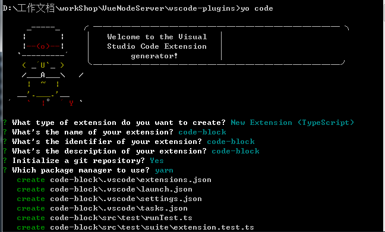

# Vscode 插件开发

可以使用 yo code 来创建插件、主题、代码片段、语言支持、键盘映射、插件包

## 基础配置

* 开发环境
```
下载安装 nodejs                  # 建议使用最新版本
npm install -g yo               # yeoman 
npm install -g generator-code   # generator-code
yo code                         # 初始化项目
```



目录结构：
```
├── .vscode             # vscode 整合
├── assets              # 图片资源
├── node_modules        # 依赖包
├── out                 # ts 编译后输出的文件夹
├── src                 # 源文件
├──├── test
├──├── extension.ts     # 入口
├── ..gitignore         # 配置不需要加入版本管理的文件
├── .vscodeignore       # 配置不需要加入最终发布到拓展中的文件
├── CHANGELOG.md        # 修改记录
├── LEARNING.md         # vscode 学习笔记
├── package.json        # 依赖配置
├── README.md           # 插件说明 README
├── tsconfig.json       # TypeScript 配置
├── tslint.json         # TypeScript 代码检查
├── vsc-extension-quickstart.md
└── yarn.lock
```

* 开发调试

```
在当前项目中，点击键盘中的 F5
ctrl + shift + p 调用插件
```

* 打包发布

[Microsoft]()、[Azure DevOps](https://aka.ms/SignupAzureDevOps)、[小茗同学](https://www.cnblogs.com/liuxianan/p/vscode-plugin-overview.html)

```
npm install -g vsce			   			  # 打包
vsce create-publisher your-publisher-name # 获得个人访问令牌后，使用vsce以下命令创建新的发布者
vsce login your-publisher-name            # 登录
vsce create-publisher XXX	        	  # 创建 XXX 插件
vsce publish				   			  # 发布
vsce publish patch						  # 增量发布 
vsce publish minor
vsce package				   			  # 生成 code-block-0.0.1.vsix 包，可以直接使用
```

* `package.json`

```json
{
	"name": "code-block",           // 名称
	"displayName": "code-block",    // 显示名称
	"description": "code-block",    // 信息描述
    "version": "0.0.1",             // 版本
    "publisher": "wqjiao",          // 发布者
	"engines": {
		"vscode": "^1.38.0"
	},
	"categories": [
		"Other"
	],
	// 活动事件列表
	"activationEvents": [
		"onCommand:extension.helloWorld", // 单独定义活动
		"*" // 表示 contributes 中的全部
	],
	"main": "./out/extension.js",   // 入口文件
	"contributes": {
		// 配置
		"configuration": {
            "type": "",
            "title": "",
            "properties": {}
		},
		// 对应命令列表
		"commands": [{
			"command": "extension.helloWorld",
			"title": "Hello World"
		}]
	},
	"scripts": {
		"vscode:prepublish": "yarn run compile",
		"compile": "tsc -p ./",
		"watch": "tsc -watch -p ./",
		"pretest": "yarn run compile",
		"test": "node ./out/test/runTest.js"
	},
	"devDependencies": {
		"@types/glob": "^7.1.1",
		"@types/mocha": "^5.2.6",
		"@types/node": "^10.12.21",
		"@types/vscode": "^1.38.0",
		"glob": "^7.1.4",
		"mocha": "^6.1.4",
		"typescript": "^3.3.1",
		"tslint": "^5.12.1",
		"vscode-test": "^1.0.2"
	}
}
```

* `extension.ts`
```js
import * as vscode from 'vscode';
 
export function activate(context: vscode.ExtensionContext) {
 
    // 这里的代码将只会在插件激活时执行一次
    console.log('Congratulations, your extension "vscode-demo" is now active!');
    
    // 定义在 package.json 中的命令在这里定义
    // 提供 registerCommand 来注册实现代码
    // commandId 参数必须与 package.json 匹配
    let disposable = vscode.commands.registerCommand('extension.helloWorld', function () {
        // 这里的代码每次执行 这个命令 的时候都会被执行
        
        // 显示信息框
        vscode.window.showInformationMessage('Hello World!');
    });
    
    context.subscriptions.push(disposable);
}
 
// 插件被停用的时候被调用
export function deactivate() {}
```

## vscode API

* windows

	- `showInputBox`

	- `showInformationMessage`

* commands

## 学习参考链接

* [nodejs](https://nodejs.org/en/)
* [npm](https://www.npmjs.com/package/npm)
* [yeoman](http://yeoman.io/)
* [generator-code](https://github.com/Microsoft/vscode-generator-code)
* [vscode-api](https://code.visualstudio.com/docs/extensionAPI/vscode-api)
* [vscode中文文档](https://jeasonstudio.gitbooks.io/vscode-cn-doc/)
* [小茗同学](https://github.com/sxei)
* [any-rule](https://github.com/any86/any-rule)
